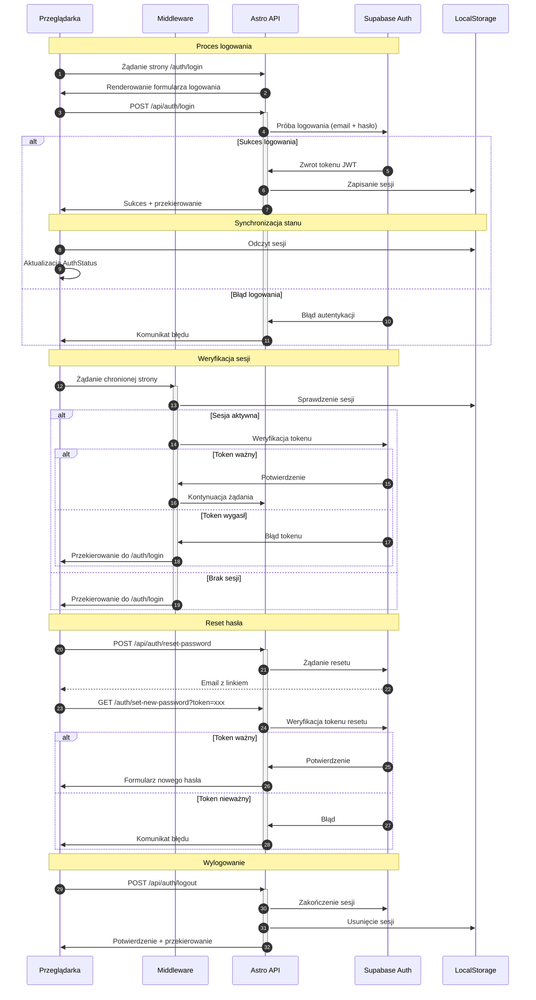

```mermaid
sequenceDiagram
    autonumber
    participant B as Przeglądarka
    participant M as Middleware
    participant A as Astro API
    participant S as Supabase Auth
    participant L as LocalStorage

    Note over B,S: Proces logowania
    B->>A: Żądanie strony /auth/login
    A->>B: Renderowanie formularza logowania
    
    B->>A: POST /api/auth/login
    activate A
    A->>S: Próba logowania (email + hasło)
    
    alt Sukces logowania
        S->>A: Zwrot tokenu JWT
        A->>L: Zapisanie sesji
        A->>B: Sukces + przekierowanie
        
        Note over B,L: Synchronizacja stanu
        B->>L: Odczyt sesji
        B->>B: Aktualizacja AuthStatus
    else Błąd logowania
        S->>A: Błąd autentykacji
        A->>B: Komunikat błędu
    end
    deactivate A

    Note over B,S: Weryfikacja sesji
    B->>M: Żądanie chronionej strony
    activate M
    M->>L: Sprawdzenie sesji
    
    alt Sesja aktywna
        M->>S: Weryfikacja tokenu
        alt Token ważny
            S->>M: Potwierdzenie
            M->>A: Kontynuacja żądania
        else Token wygasł
            S->>M: Błąd tokenu
            M->>B: Przekierowanie do /auth/login
        end
    else Brak sesji
        M->>B: Przekierowanie do /auth/login
    end
    deactivate M

    Note over B,S: Reset hasła
    B->>A: POST /api/auth/reset-password
    activate A
    A->>S: Żądanie resetu
    S-->>B: Email z linkiem
    
    B->>A: GET /auth/set-new-password?token=xxx
    A->>S: Weryfikacja tokenu resetu
    
    alt Token ważny
        S->>A: Potwierdzenie
        A->>B: Formularz nowego hasła
    else Token nieważny
        S->>A: Błąd
        A->>B: Komunikat błędu
    end
    deactivate A

    Note over B,S: Wylogowanie
    B->>A: POST /api/auth/logout
    activate A
    A->>S: Zakończenie sesji
    A->>L: Usunięcie sesji
    A->>B: Potwierdzenie + przekierowanie
    deactivate A
```