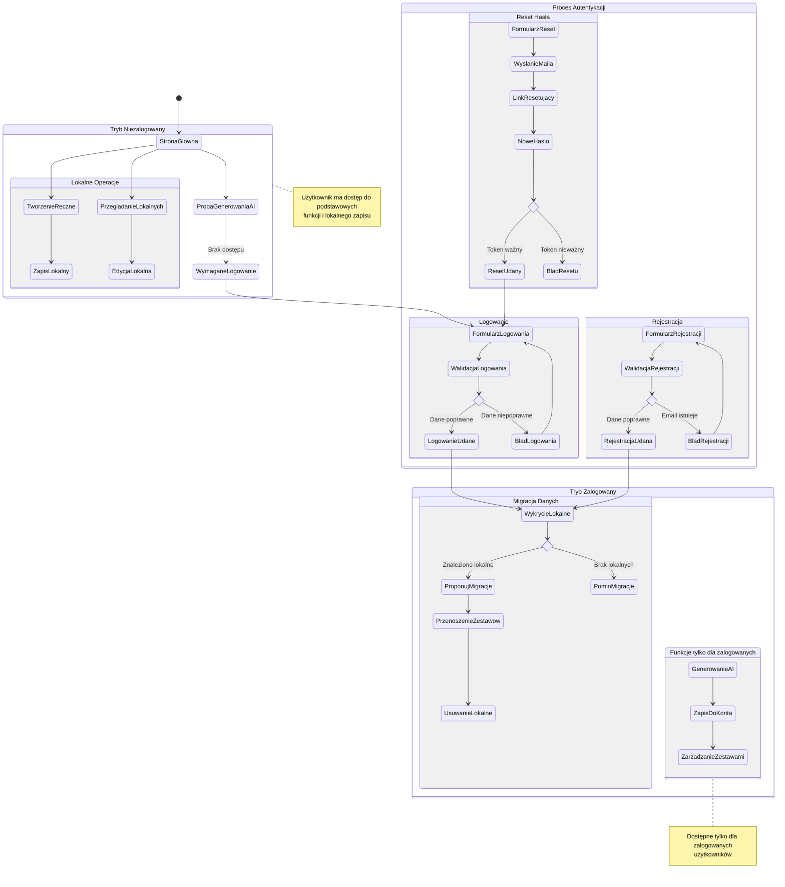

```mermaid
stateDiagram-v2
    [*] --> StronaGlowna
    
    state "Tryb Niezalogowany" as TrybNiezalogowany {
        StronaGlowna --> TworzenieReczne
        StronaGlowna --> PrzegladanieLokalnych
        StronaGlowna --> ProbaGenerowaniaAI
        
        state "Lokalne Operacje" as LokalneOperacje {
            TworzenieReczne --> ZapisLokalny
            PrzegladanieLokalnych --> EdycjaLokalna
        }
        
        ProbaGenerowaniaAI --> WymaganeLogowanie: Brak dostępu
    }
    
    state "Proces Autentykacji" as Autentykacja {
        state "Logowanie" as Logowanie {
            FormularzLogowania --> WalidacjaLogowania
            
            state if_logowanie <<choice>>
            WalidacjaLogowania --> if_logowanie
            if_logowanie --> LogowanieUdane: Dane poprawne
            if_logowanie --> BladLogowania: Dane niepoprawne
            
            BladLogowania --> FormularzLogowania
        }
        
        state "Rejestracja" as Rejestracja {
            FormularzRejestracji --> WalidacjaRejestracji
            
            state if_rejestracja <<choice>>
            WalidacjaRejestracji --> if_rejestracja
            if_rejestracja --> RejestracjaUdana: Dane poprawne
            if_rejestracja --> BladRejestracji: Email istnieje
            
            BladRejestracji --> FormularzRejestracji
        }
        
        state "Reset Hasła" as ResetHasla {
            FormularzReset --> WyslanieMaila
            WyslanieMaila --> LinkResetujacy
            LinkResetujacy --> NoweHaslo
            
            state if_reset <<choice>>
            NoweHaslo --> if_reset
            if_reset --> ResetUdany: Token ważny
            if_reset --> BladResetu: Token nieważny
        }
    }
    
    state "Tryb Zalogowany" as TrybZalogowany {
        state "Migracja Danych" as MigracjaDanych {
            state if_lokalne <<choice>>
            WykrycieLokalne --> if_lokalne
            if_lokalne --> ProponujMigracje: Znaleziono lokalne
            if_lokalne --> PominMigracje: Brak lokalnych
            
            ProponujMigracje --> PrzenoszenieZestawow
            PrzenoszenieZestawow --> UsuwanieLokalne
        }
        
        state "Funkcje tylko dla zalogowanych" as FunkcjePremium {
            GenerowanieAI --> ZapisDoKonta
            ZapisDoKonta --> ZarzadzanieZestawami
        }
    }
    
    WymaganeLogowanie --> FormularzLogowania
    LogowanieUdane --> WykrycieLokalne
    RejestracjaUdana --> WykrycieLokalne
    ResetUdany --> FormularzLogowania
    
    note right of TrybNiezalogowany
        Użytkownik ma dostęp do podstawowych
        funkcji i lokalnego zapisu
    end note
    
    note right of FunkcjePremium
        Dostępne tylko dla zalogowanych
        użytkowników
    end note
```
