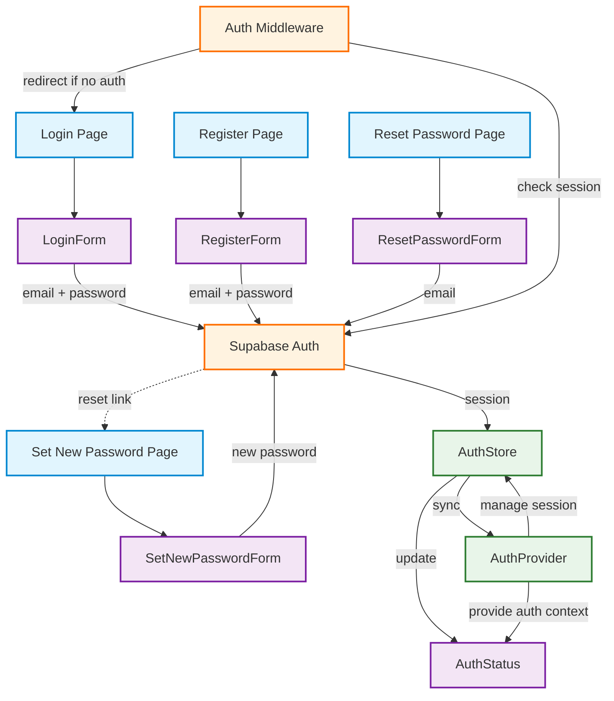

```mermaid
flowchart TD
    classDef page fill:#e1f5fe,stroke:#0288d1,stroke-width:2px
    classDef component fill:#f3e5f5,stroke:#7b1fa2,stroke-width:2px
    classDef service fill:#fff3e0,stroke:#ff6f00,stroke-width:2px
    classDef store fill:#e8f5e9,stroke:#2e7d32,stroke-width:2px

    %% Strony Astro
    Login["Login Page"]:::page
    Register["Register Page"]:::page
    Reset["Reset Password Page"]:::page
    SetNew["Set New Password Page"]:::page

    %% Komponenty React
    LoginForm["LoginForm"]:::component
    RegisterForm["RegisterForm"]:::component
    ResetForm["ResetPasswordForm"]:::component
    SetNewForm["SetNewPasswordForm"]:::component
    AuthStatus["AuthStatus"]:::component

    %% Serwisy i przechowywanie stanu
    SupabaseAuth["Supabase Auth"]:::service
    AuthStore["AuthStore"]:::store
    AuthProvider["AuthProvider"]:::store
    Middleware["Auth Middleware"]:::service

    %% Przepływ logowania
    Login --> LoginForm
    LoginForm --"email + password"--> SupabaseAuth
    SupabaseAuth --"session"--> AuthStore
    AuthStore --"update"--> AuthStatus
    AuthStore --"sync"--> AuthProvider

    %% Przepływ rejestracji
    Register --> RegisterForm
    RegisterForm --"email + password"--> SupabaseAuth
    
    %% Przepływ resetowania hasła
    Reset --> ResetForm
    ResetForm --"email"--> SupabaseAuth
    SupabaseAuth -."reset link".-> SetNew
    SetNew --> SetNewForm
    SetNewForm --"new password"--> SupabaseAuth

    %% Middleware i ochrona stron
    Middleware --"check session"--> SupabaseAuth
    Middleware --"redirect if no auth"--> Login
    
    %% Stan aplikacji
    AuthProvider --"provide auth context"--> AuthStatus
    AuthProvider --"manage session"--> AuthStore
```
